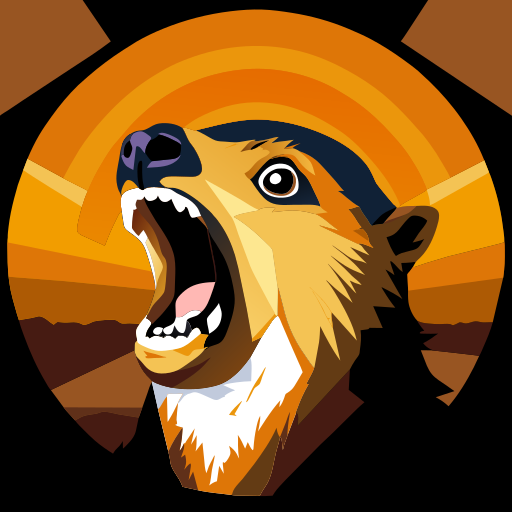

# hyrax

**Hy**pertext **R**esource **A**ctivity e**X**posure (that's **ActivityPub** and **RSS** exposure to you and me, as well as more [IndieWeb](https://indieweb.org/) tech going forwards) for **ASP.NET** websites.

The project aims to provide configuration options for **ASP.NET Core** and the **Umbraco CMS** (~12+) to expose **ActivityPub** endpoints and **RSS** feeds to expose blog content to RSS readers and the fediverse.

[Hyraxes](https://en.wikipedia.org/wiki/Hyrax) or *dassies*, although similar in appearance a marmot or particularly angry rodent, are actually part of the [paenungulata](https://en.wikipedia.org/wiki/Paenungulata) clade along with elephants and **mastodons**.

 

## Installation

Add the package to an existing Umbraco website (v10.4+) from nuget:

`dotnet add package hyrax.Umbraco`

TODO *provide any other instructions for someone using your package*

## Contributing

Contributions to this package are most welcome! Please read the [Contributing Guidelines](.github/CONTRIBUTING.md).

## Acknowledgments

[Matt Brailsford](https://umbracocommunity.social/@matt) and [Rachel Breeze](https://geekdom.social/@rachelbreezedev) for brainstorming, researching and pair-programming at [CODECABIN23](https://joe.gl/ombek/blog/codecabin-23/).

<small>Hyrax icon generated by AI with Recraft</small>
