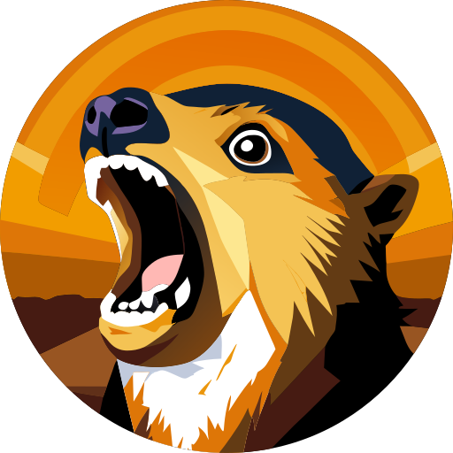

# hyrax

**Hy**pertext **R**esource **A**ctivity e**X**posure (that's **ActivityPub** and **RSS** exposure to you and me) for **ASP.NET** websites.

The project aims to provide configuration options for **ASP.NET Core** and the **Umbraco CMS** (~12+) to expose **ActivityPub** endpoints and **RSS** feeds to expose blog content to RSS readers and the fediverse.

[Hyraxes](https://en.wikipedia.org/wiki/Hyrax) or *dassies*, although similar in appearance a marmot or particularly angry rodent, are actually part of the [paenungulata](https://en.wikipedia.org/wiki/Paenungulata) clade along with elephants and **mastodons**.

<small>Hyrax icon generated by AI with Recraft</small>
